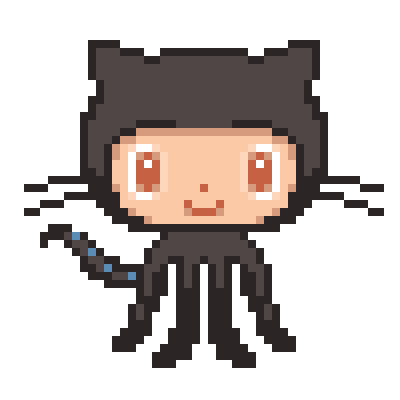
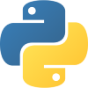
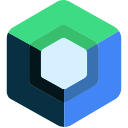
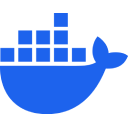

[](https://github.com/kunal-ma)
[](https://github.com/kunal-ma/Ticksync)
[](https://kunalma.com)
[](mailto:kunalma23@gmail.com)
[](https://www.linkedin.com/in/kunal-ma)
[](https://www.leetcode.com/kunal-ma)

```js
class SoftwareDeveloper {
    constructor() {
        this.name = "Kunal M.A.";
        this.age = 21;
        this.role = "Software Developer";
        this.language = ["en", "hi", "kn"];
    }

    sayHi() {
        console.log("Hi there! Nice to meet you :)");
    }
}

const me = new SoftwareDeveloper();
me.sayHi();
```



<br>🎓 Pursuing my 4th year of B.Tech IT at Manipal University Jaipur
<br>⚡ Hands-on experience working with C++, Python, and Kotlin
<br>🧪 Currently exploring app development and machine learning
<br>🌱 Usually working (obsessing) on random projects in my free time
<br>✨ Fun Fact: The first webcam was created to monitor a coffee pot

### Languages:





<br><br>

### Frameworks & Tools:







<br><br>



