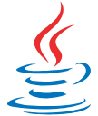
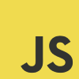
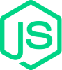
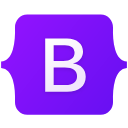
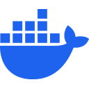

## Hi there 👋🏼

My name is Kunal M.A., and I’m a **Full Stack Developer** from Ahmedabad, India. I have experience working with a variety of languages and frameworks, and I enjoy building projects that address real-world gaps, especially those I’ve experienced firsthand. Most of my professional work centers around:

- 🌐 Full-stack web applications built with modern frameworks
- 🛠️ Scalable backend services, REST APIs, and system design
- 🧩 Native Android application development using Kotlin
- 🚀 CI/CD pipelines & deployment workflows using GitHub Actions

### Languages:

<picture></picture>
<picture></picture>
<picture></picture>
<picture></picture>
<picture></picture>
<picture></picture>

  

### Frameworks & Tools:

<picture></picture>
<picture></picture>
<picture></picture>
<picture></picture>
<picture></picture>
<picture></picture>
<picture></picture>
<picture></picture>
<picture></picture>

  

---

*⭐ “Talk is cheap. Show me the code.” - Linus Torvalds*

**[Website](https://kunalma.com)** · **[Email](mailto:kunalma23@gmail.com)** · **[LinkedIn](https://www.linkedin.com/in/kunal-ma/)**

